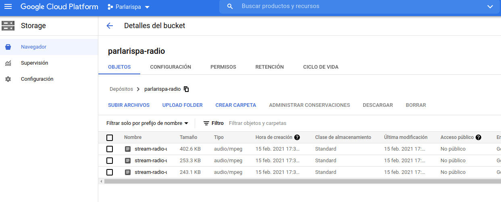
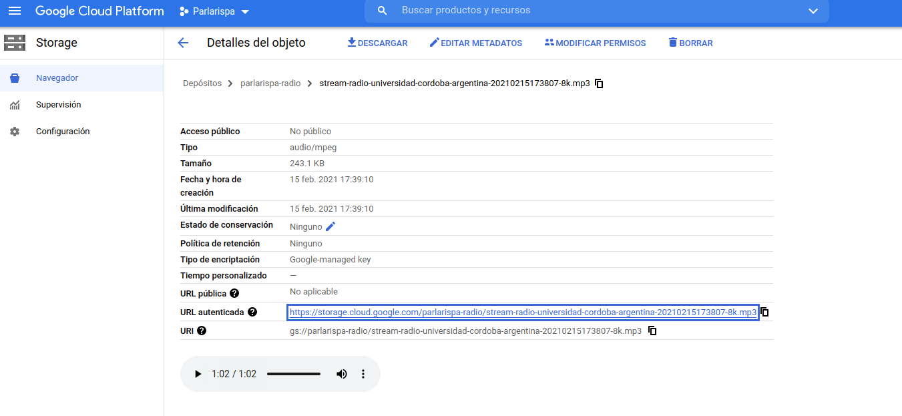
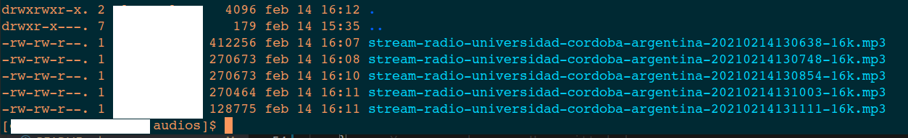

[](https://pypi.org/project/yaasr/)
[](https://github.com/avdata99/yaasr/releases)
[](https://github.com/avdata99/yaasr/issues)
[](https://github.com/avdata99/yaasr/pulls)
[](https://github.com/avdata99/yaasr/blob/main/LICENSE)
[](https://github.com/avdata99/yaasr/commits/main)

# Yet Another Audio Stream Recorder

Audio stream recorded and static DB for radio stations.  
**Why?** Because other tools are (probably, [is not clear](https://github.com/mgaitan/radiocut_downloader/pull/18#issuecomment-526191324)) not availabe to use.

## Install

Install with pip

```
pip install yaasr
```

## Usage

### From Python

#### Save predefined audio locally

Load a pre-defined stream and save 5 audio chunks of 60 seconds

```python
from yaasr.recorder.stream import YStream

ys = YStream('radio-universidad-cordoba-argentina')
ys.load()
ys.record(total_seconds=300, chunk_bytes_size=1024, chunk_time_size=60)
```

You will see new audio files at your local folder

#### Save custom audio locally

Load a custom stream and save 5 audio chunks of 60 seconds

```python
from yaasr.recorder.stream import YStream

""" test custom stream """
ys = YStream(stream_name='my-custom-stream')
ys.destination_folder = 'some-path/my-chunks-folder'
ys.title = 'My radio title'
ys.short_name = 'my-radio'

# list of stream (if first fails the second should be used)
ys.streams = [
    {'url': 'https://my-radio.org/stream'}
]

ys.record(total_seconds=300, chunk_bytes_size=1024, chunk_time_size=5)
```

You will see new audio files at `some-path/my-chunks-folder` folder

#### Upload to Google Cloud Storage

```python
from yaasr.recorder.stream import YStream
from yaasr.processors.audio.reduce import reformat
from yaasr.processors.archive.google_cloud import upload_to_google_cloud_storage

# os.environ["GOOGLE_APPLICATION_CREDENTIALS"] = "google-cloud-storage-credential.json"
ys = YStream('radio-universidad-cordoba-argentina')
ys.load()

# post-processors (you can combine or create new processors)
ys.post_process_functions = [
    {
        'fn': reformat,
        'params': {
            'audio_format': 'mp3',
            'mono': True,
            'delete_on_success': True
        }
    },
    {
        'fn': upload_to_google_cloud_storage,
        'params': {
            'bucket_name': 'parlarispa-radio',
            'delete_on_success': True
        }
    }
]
ys.record(total_seconds=300, chunk_bytes_size=1024, chunk_time_size=60)
```




#### Upload audio chunks using ssh

Post process audio to MP3 16Khz and upload via ssh the result cleaning local files after the process

```python
from yaasr.recorder.stream import YStream
from yaasr.processors.audio.reduce import reformat
from yaasr.processors.archive.ssh import upload_ssh


ys = YStream('radio-universidad-cordoba-argentina')
ys.load()

# post-processors (you can combine or create new processors)
ys.post_process_functions = [
    {
        'fn': reformat,
        'params': {
            'audio_format': 'mp3',
            'delete_on_success': True
        }
    },
    {
        'fn': upload_ssh,
        'params': {
            'host': 'myhost.com',
            'user': 'username',
            'password': 'mypass',
            'destination_folder': '/home/username/audios/',
            'port': 901,
            'delete_on_success': True
        }
    }
]
ys.record(total_seconds=300, chunk_bytes_size=1024, chunk_time_size=60)
```



### Usage from command line

List all available streams

```
$ yaasr ls
radio-bio-bio-santiago-chile: https://unlimited4-us.dps.live/biobiosantiago/aac/icecast.audio
radio-universidad-cordoba-argentina: https://sp4.colombiatelecom.com.co:10995/stream
```

Info about a stream

```
$ yaasr info --stream radio-bio-bio-santiago-chile
{
    "title": "Bio Bio Santiago de Chile",
    "web": "https://vivo.biobiochile.cl/player/",
    "streams": [
        {
            "url": "https://unlimited4-us.dps.live/biobiosantiago/aac/icecast.audio",
            "extension": "aac"
        }
    ]
}
```

Record a stream

```
$ yaasr record \
    --stream radio-bio-bio-santiago-chile \
    --total_seconds 90 \
    --chunk_bytes_size 512 \
    --chunk_time_size 30

2021-02-14 18:27:20,382 - yaasr.recorder.stream - INFO - Attempt to record from https://unlimited4-us.dps.live/biobiosantiago/aac/icecast.audio
2021-02-14 18:27:21,244 - yaasr.recorder.stream - INFO - Recording from https://unlimited4-us.dps.live/biobiosantiago/aac/icecast.audio
2021-02-14 18:27:56,923 - yaasr.recorder.stream - INFO - 2021-02-14 18:27:56.923239 Elapsed 0:00:35.679521 Finish chunk 1274
2021-02-14 18:27:56,924 - yaasr.recorder.stream - INFO - Chunk finished
2021-02-14 18:28:27,132 - yaasr.recorder.stream - INFO - 2021-02-14 18:28:27.131768 Elapsed 0:01:05.888050 Finish chunk 1981
2021-02-14 18:28:27,132 - yaasr.recorder.stream - INFO - Chunk finished
2021-02-14 18:28:51,294 - yaasr.recorder.stream - INFO - Finish recording 2021-02-14 18:28:51.294881
2021-02-14 18:28:51,295 - yaasr.recorder.stream - INFO - Chunk finished
```

### More docs

 - Add recording task to [supervisor](docs/run-with-supervisor.md)
